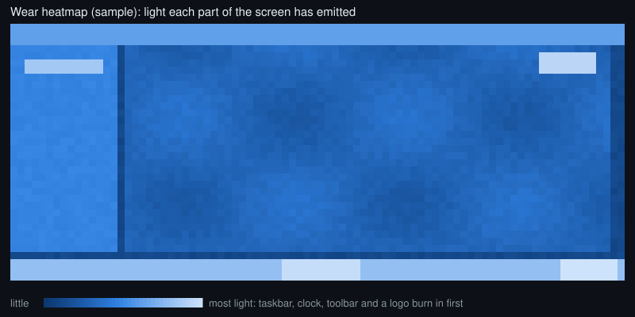

# Wanelight

OLED burn-in protection for Windows 10/11.

Burn-in comes from bright pixels that stay the same for hours. Wanelight keeps them dark
with two main tools:

- **Torch** keeps only what you're working on lit and dims everything else.
- **Deeper blacks** turns the dark grays of every app into true black, so those pixels switch off.

Both switch on and off with a shortcut or from the tray. Around them, Wanelight rests the
screen when you step away, lets the panel run its care cycle, and can also dim still areas
on its own.

## See it

The animations below are illustrations: the real overlay is excluded from screen capture, so it
can't be recorded. Dimming is exaggerated so it reads clearly at thumbnail size.

### Torch, spotlight style

A flashlight for your screen: only a soft circle around the pointer stays lit. Toggle it with Ctrl+Alt+Shift+T. The circle size and dim level are adjustable.

<p align="center"></p>

### Torch, panel style

Only the panel under the pointer stays lit. Start typing and only the text box does.

<p align="center"></p>

### Deeper blacks

A dark theme is still made of dark grays, and every one of those pixels is lit. Deeper blacks turns grays up to a level you choose into true black, in every app at once. Whites and colours stay.

<p align="center"></p>

### Away

No input and nothing moving for 5 minutes: the screen fades down. Any input brings it straight back.

<p align="center"></p>

### Dim still areas

Bright areas that haven't changed for a while fade down, too slowly to notice. A playing video is never touched, and anything that changes brightens at once.

<p align="center"></p>

### Hide toolbars until needed

In a full-screen app, still toolbars, sidebars and status bars dim and light up again when you reach for them.

<p align="center"></p>

### Wear map

The settings window shows how much light each part of each screen has given off, so you can see where burn-in would show first.

<p align="center"></p>

## What it does

| Feature | Behaviour |
|---|---|
| **Torch** *(off until you turn it on)* | Only your focus stays lit, and everything else dims by 60%. You choose what stays lit: the window you're using plus a little around the pointer; a circle around the pointer; or the **panel** under the pointer (sidebar, main area, side pane). In panel style, typing lights only the text box. Panels are found through UI Automation, which reads layout only, never text. Toggle with **Ctrl+Alt+Shift+T**, from Home or from the tray. |
| **Deeper blacks** *(off until you turn it on)* | A full-screen colour matrix, the same mechanism as Windows colour filters, turns grays up to #262626 (adjustable) into true black and leaves whites alone. Toggle it from Home, the tray or a shortcut you set. It doesn't work while Magnifier or colour filters are on. |
| **Fade when you step away** | No input *and* a still screen for 5 minutes fades the screen down. Any input restores it at once. |
| **Turn displays off** | After 20 minutes away, the displays go to sleep, unless audio is playing. |
| **Lower monitor brightness** *(off by default)* | While you're away, also lowers the monitor's own brightness over DDC/CI. The original brightness comes back on exit, and after a crash on the next start. |
| **Panel rest** | Counts panel-on hours. After 4 hours it turns the display off at a quiet moment so the panel can run its care cycle. |
| **Dim still areas** | Samples each monitor about once a second (DXGI Desktop Duplication, reduced on the GPU to 16×16-pixel cells). Bright areas unchanged for 3 minutes fade down by up to 25% (taskbar, sidebars, logos, HUDs). The window you're using is dimmed at most 10%, and only after 15 minutes. Displays you're not using and apps left open all day get stronger dimming. On by default; turn it off under More dimming. |
| **Hide toolbars until needed** *(off by default)* | When the window you're using fills the screen, its still edges (toolbars, tab strips, sidebars, status bar) dim to 50%. They light up when the pointer comes within 100 px, or while Alt is held, and dim again 3 s after it leaves. |
| **Wear map** | Keeps a per-cell record of light given off and light saved by dimming, and shows it in the settings window. |
| **Windows setup** | Reversible OLED-friendly Windows settings, each a switch: dark mode, black desktop, hidden icons, no accent colour, taskbar auto-hide, display timeout. Turning one off puts your previous setting back. |

It is designed to be non-disruptive:

- The overlay is click-through and never takes focus.
- It is hidden entirely when nothing is dimmed, and otherwise covers only the dimmed region.
- It is excluded from screen capture, so screenshots and streams never show it, and Wanelight's own sampling isn't fooled by it.
- Presentation mode and apps you exclude pause everything.
- Pause or resume anytime with **Ctrl+Alt+Shift+W**, from Home or from the tray menu.

Measured on a 3440×1440 display: about 3.5 ms per sample, around 0.3% of one CPU core, and about 50 MB of RAM.

## Settings

Open the settings window from the tray icon, or by running `wanelight.exe` again.

| Page | What's there |
|---|---|
| **Home** | Whether protection is on, Pause, Torch and Deeper blacks, your displays, panel rest and start with Windows |
| **Torch** | What stays lit, how much the rest dims, the shortcut |
| **Deeper blacks** | How dark counts as black, with a before and after preview, and the shortcut |
| **Away and rest** | Fading, turning displays off, monitor brightness, panel rest |
| **Apps** | Apps never to dim, and apps left open all day. Pick from open apps or type a name. |
| **More dimming** | Dim still areas (Gentle, Balanced or Strong) and hide toolbars until needed |
| **Wear map** | Light given off, or saved, per part of each screen |
| **Windows setup** | The reversible Windows settings |

Each page shows the main settings. Turn on **Show all settings** at the bottom of the sidebar to see every one.
To change a shortcut, click it and press the new keys.

## Build

Requires the Rust MSVC toolchain (1.92+) and the Windows SDK (for `rc.exe`).

```bash
cargo build --release
```

The result is a single file, `target\release\wanelight.exe`.

## Use

```bash
wanelight.exe
```

This starts the tray agent; running it again opens the settings window. Other flags:

| Flag | Purpose |
|---|---|
| `--ui [page]` | Open the settings window (`home`, `torch`, `blacks`, `away`, `apps`, `more`, `wear`, `windows`) |
| `--status` | Print the running agent's status as JSON |
| `--quit` | Stop the running agent |
| `--selftest` | Check capture, the GPU shader and capture exclusion (briefly dims a small square) |
| `--selftest --map` | Read-only: print a map of which parts of the screen are changing |
| `--test-surface [secs]` | Show a white test square to watch dimming happen |
| `--panel-probe [--brief]` | Print the UI panels the torch panel style would pick in the foreground window (layout only) |

Settings, logs and wear data live in `%APPDATA%\Wanelight`. Setting `WANELIGHT_DATA_DIR` uses another folder and runs an isolated instance next to the normal one, which is handy for testing.
`config.toml` can be edited by hand; the agent reloads it within a second.

## Layout

```
src/agent/capture.rs   Desktop Duplication + compute shader -> per-cell stats
src/agent/model.rs     static-time model, dimming policy, ramps, feathering
src/agent/winmap.rs    z-ordered window map (foreground, taskbar, per-app rules)
src/agent/overlay.rs   DirectComposition click-through overlay (capture-excluded)
src/agent/panels.rs    UI Automation panel finder for the torch panel style
src/agent/color.rs     full-screen colour matrix for deeper blacks
src/agent/ddc.rs       DDC/CI worker thread with crash-safe restore
src/agent/mod.rs       tray agent, tiers, power/away logic
src/ui/                settings window (egui, separate process)
src/hardening.rs       reversible Windows tweaks
```
